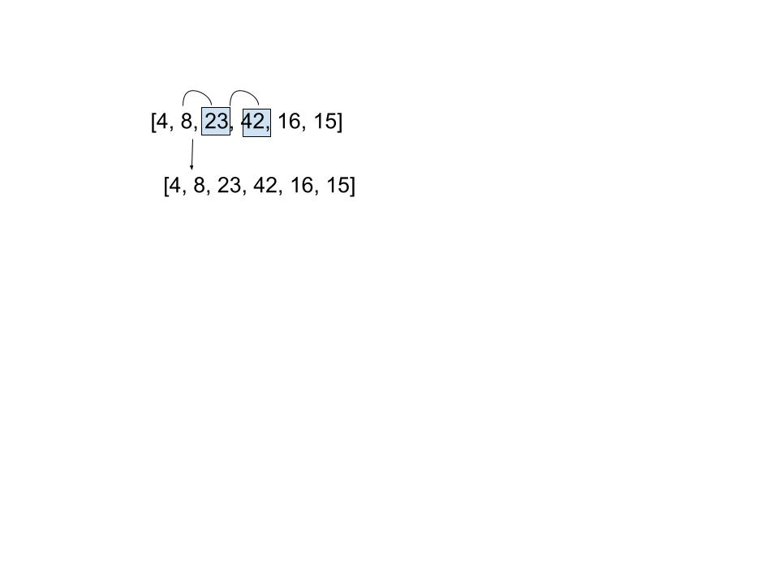
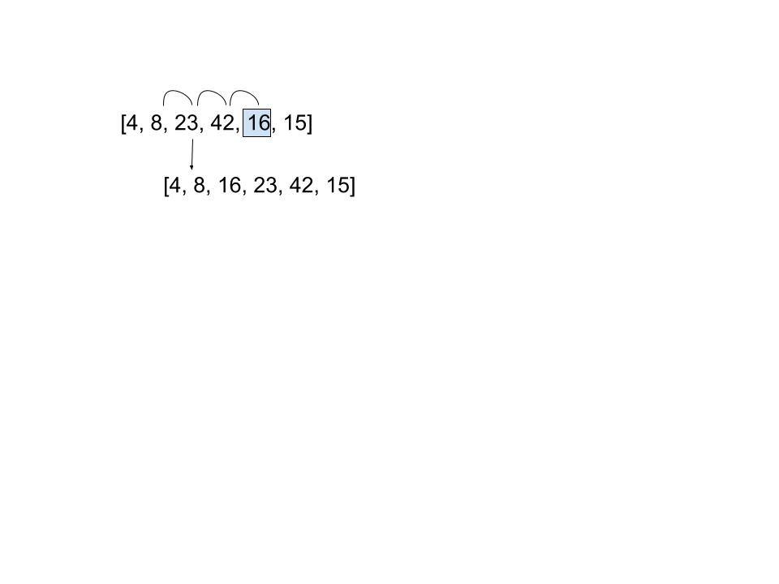
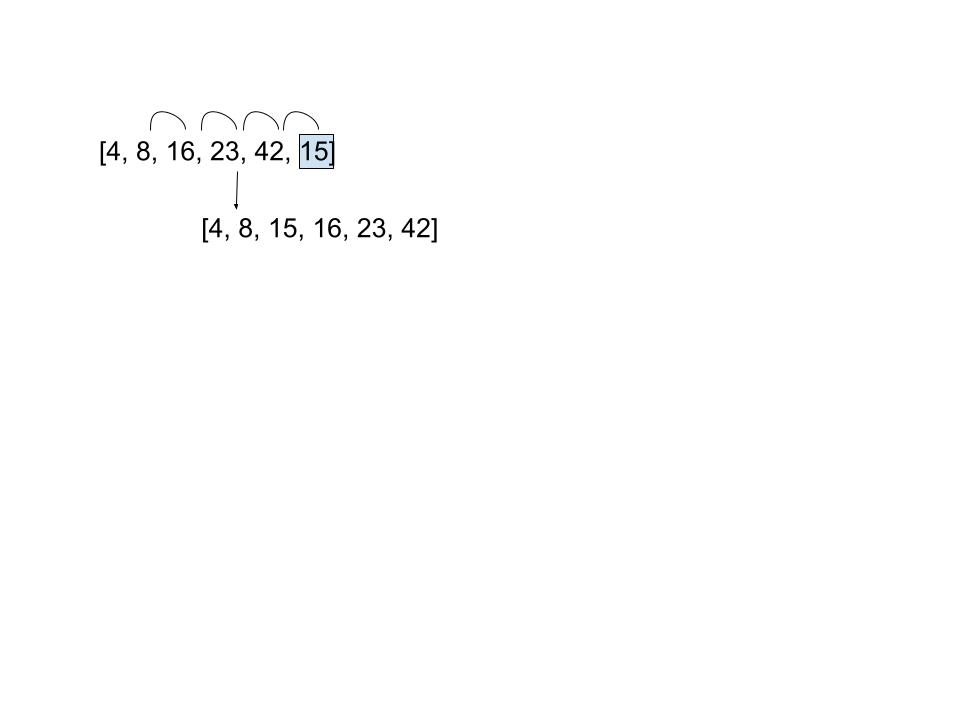

# Insertion Sort

- [code](challenges/lib/src/main/java/challenges/utilities/InsertionSort.java)

This document will review an insertion sort algorithm and step through it's execution. Values are sorted into their proper position in the array as the array is iterated through. 

On the first pass the first number is evaluated against the second number and determined to be larger. The second number and the first numbers positions are swapped and the loop ends because there are no further numbers to compare against.

On the second and third passes the third number is compared to the second and confirmed to be larger. No changes are made.

On the fourth pass the fifth number is compared to the fourth, sees that it's smaller and switches positions with it. It then compares with the third number and sees that it is also smalled than the third and switches again. Finally it compares with the second and sees that it is smaller and stops.

On the fifth pass the sixth number is compared to the fifth, switches, the fourth, switches, the third, switches, then finally the second and stops.

## Efficiency

Time: O(n^2) worst case scenario is if the array is passed in in reverse sorted order

Space: O(1) no additional space is being created. Space stays constant.