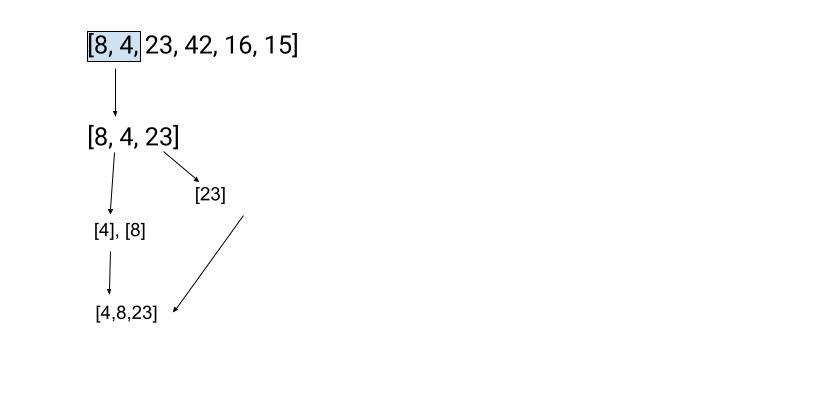
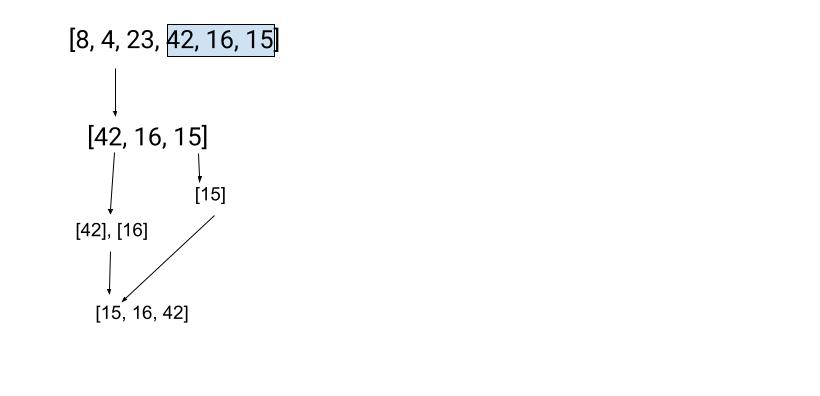
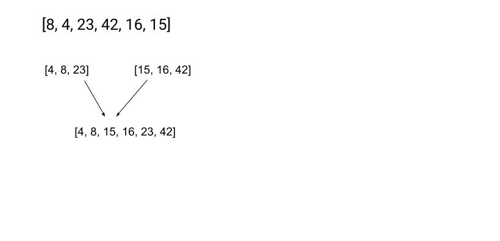

# Merge Sort

Merge sort is an algorithm that divides an array into the smallest pieces possible (an array with the size of 1) and comparing it to the pieces around it before combing together into a sorted array and then comparing that sorted array to another and merging them together.

Given a six digit unsorted array our algorithm first takes the first 3 indices then breaks them up into an array of 2 and an array of 1 then takes the array of 2, splits it again before merging them back together as sorted then comparing with the single array merge that array into the sorted one. 

The process is then repeated for the other side of the array.

Finally the 2 sorted arrays are merged together.

## Efficiency

- Time: n log n Each time the amount of units in the array doubles time m increases by 1

- Space n log n Each time the amount of units in the array doubles space m increases by 1
