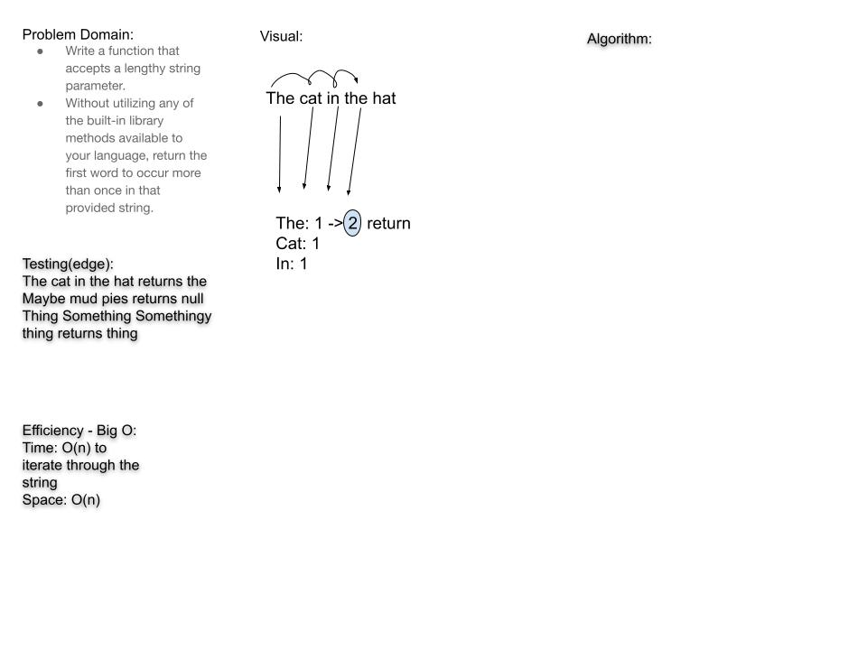

# Challenge Summary

Takes in a String and returns the first repeated word or returns null if none are repeated.

## Challenge Description

Write a function that accepts a lengthy string parameter.
Without utilizing any of the built-in library methods available to your language, return the first word to occur more than once in that provided string.

## Approach & Efficiency

- Time: O(n) because we have to iterate through each word in the string

- Space: O(1)

## Solution

- [code](challenges/lib/src/main/java/challenges/repeatedWord/RepeatedWord.java)