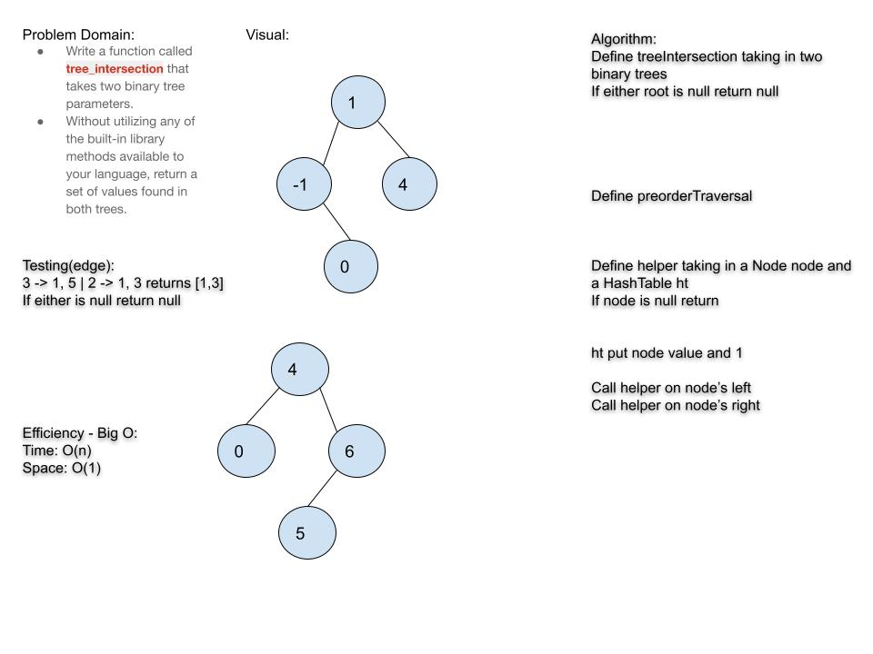

# Challenge Summary

Take in 2 binary trees and return an array of all values that are repeated.

## Challenge Description

Write a function called tree_intersection that takes two binary tree parameters.
Without utilizing any of the built-in library methods available to your language, return a set of values found in both trees.

## Approach & Efficiency

- Time: O(n) because we're iterating through each tree once

- Space: O(1)

## Solution

- [code](challenges/lib/src/main/java/challenges/TreeIntersection/TreeIntersection.java)