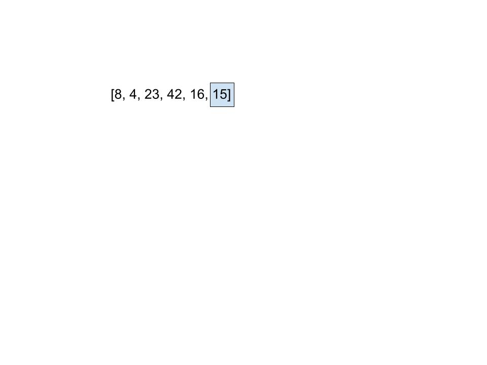
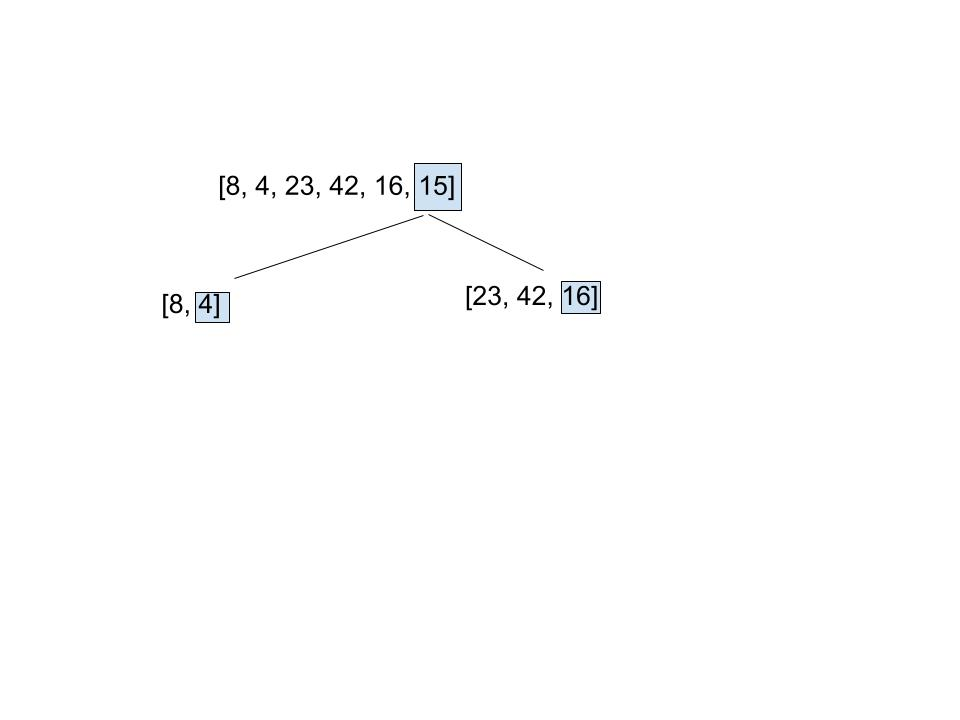
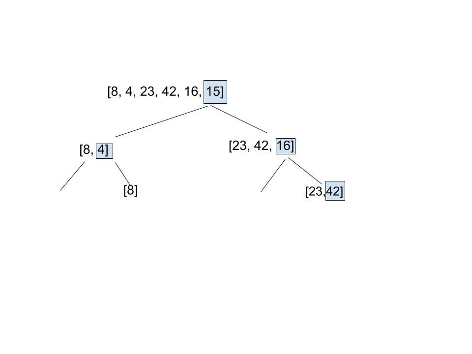

# Quick Sort

Quick Sort pciks a specific element and sorts the rest of the array around the specified element. In this example we'll use the last element as the element we pivot and partition around.

On the first pass the rest of the array aside from the specified pivot is put into to smaller arrays the left being numbers smaller than the pivot and right being larger than the pivot.

On the second pass our left side completes when it sees the 8 is larger than the 4 and there are no remaining pieces. On the right side 2 numbers are determined to be greater than 16 so are paired together and the right number becomes the pivot.

On the final pass 23 is determined to be left or less than 42 and the process completes. 

## Efficieny
Time: n log n each time the length of the array doubles the time will increase by 1m
Space: O(1) function is being performed in place